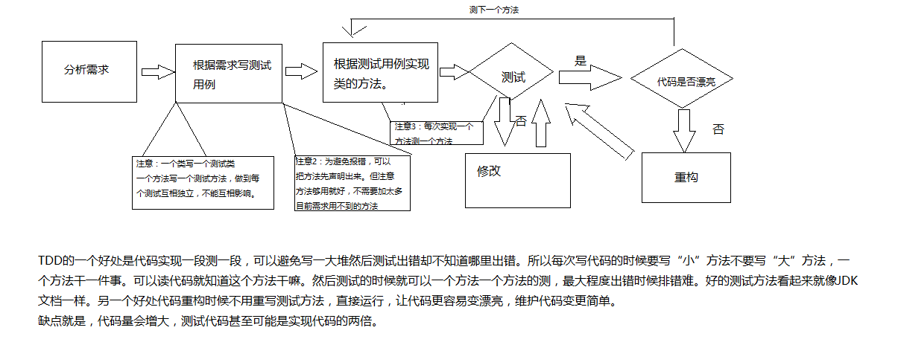

# TDD测试演示

### TDD，是踢蛋蛋，啊不，是测试驱动开发的简称

那什么是TDD，其实可以粗浅的理解为，先写测试类。
详细可以百度。

TDD的实现流程可以大概下图表示：

### 我们先看下下面这个需求。

模拟小白和小强打架，小白和小强有普通攻击和大招，还有状态。

在打架之后，小白和小强的状态会改变（状态简化为只有血量）。
小白的A为普通攻击会扣5滴血，B为大招回自己10滴血，扣对方10滴血。小白最大血量120。
小强的A为普通攻击会扣6滴血，B为大招伤自己5滴血，扣对方30滴血。小强最大血量100。

### 我们先上手一个测试类。（代码为java，你们可以补充其他语言的例子）

首先，要测试这小白和小强打架，肯定先要有个小白和小强，然后他们打架。
这个打架的执行用一个业务类来执行，叫Fight。
所以我们先写一个测试类叫FightTest，为Fight这个业务类编写测试，专门用来测试Fight

测试先行，我们就要先想Fight类中有什么。这个业务类应该有一个方法Fight.action。这个方法是打架的动作。

Fight.action这个方法传入两个Role（角色）和一个代表动作的字符 action
这个Fight.action可以用来执行小白和小强打架的动作

然后要有两个角色Role，一个小白LittleWhite，一个小强LitterStrong。实现这两个对象
所以我们直接写出两个对象new出来，然后写出Fight.action方法的测试用例

所以我们要写一个Fight测试用例（诺，TDD就是先写测试）我们要思考怎么测试Fight.action才是符合需求的。
让测试结果符合需求。

由于我们需求是让攻击之后角色状态改变，所以我们要测试每一种攻击的可能造成的结果是否符合需求。

 public class FightTest {
    Fight f = null;
	Role littleWhite = null;
	Role littleStrong = null;
	
	 //@Before注解的意思是每次执行@Test注解测试的时候都会执行@Before注解的内容
	@Before
	public void setUp() throws Exception {
		f = new Fight();
		littleWhite = new Role();
		littleStrong = new Role();
		
		
	}

	
	//@Test注解用来执行测试，该方法测试Fight.action
	//记住，一个类写一个测试类，每个方法写一个测试方法（一些比较简单的方法比如get，set那些可以不用测）
	@Test
	public void testAction() {
			
		State state = new State();
		
		//初始化状态测试,测试血量超过最大值的情况
		state.setBlood(130);
		littleWhite.setState(state);
		littleStrong.setState(state);
		
		state.setBlood(120);
		Assert.assertEquals(state, littleWhite.getState());
		state.setBlood(100);
		Assert.assertEquals(state, littleStrong.getState());
		
		state.setBlood(100);
		littleWhite.setState(state);
		littleStrong.setState(state);
		
		//littleWhite的所有攻击测试包括边际条件

		//进攻方，防守方，攻击方式A。
		f.action(littleWhite, littleStrong, 'A');
		state.setBlood(95);
		Assert.assertEquals(state, littleStrong.getState());
		
		state.setBlood(120);
		littleWhite.setState(state);
		state.setBlood(100);
		littleStrong.setState(state);
		
		f.action(littleWhite, littleStrong, 'B');
		state.setBlood(120);
		Assert.assertEquals(state, littleWhite.getState());
		state.setBlood(90);
		Assert.assertEquals(state, littleStrong.getState());
		
		state.setBlood(0);
		littleStrong.setState(state);
		
		f.action(littleWhite, littleStrong, 'A');
		Assert.assertEquals(state, littleStrong.getState());
		
		state.setBlood(1);
		littleStrong.setState(state);
		
		f.action(littleWhite, littleStrong, 'A');
		state.setBlood(0);
		Assert.assertEquals(state, littleStrong.getState());
		
		state.setBlood(0);
		littleStrong.setState(state);
		
		f.action(littleWhite, littleStrong, 'B');
		Assert.assertEquals(state, littleStrong.getState());
		
		state.setBlood(1);
		littleStrong.setState(state);
		
		f.action(littleWhite, littleStrong, 'B');
		state.setBlood(0);
		Assert.assertEquals(state, littleStrong.getState());
		
		state.setBlood(100);
		littleWhite.setState(state);
		
		//littleStrong的所有攻击测试包括边际条件

		
		f.action(littleStrong, littleWhite, 'A');
		state.setBlood(94);
		Assert.assertEquals(state, littleWhite.getState());
		
		state.setBlood(100);
		littleWhite.setState(state);
		
		f.action(littleStrong, littleWhite, 'B');
		state.setBlood(70);
		Assert.assertEquals(state, littleWhite.getState());
		
		state.setBlood(0);
		littleWhite.setState(state);
		
		f.action(littleStrong, littleWhite, 'A');
		state.setBlood(0);
		Assert.assertEquals(state, littleWhite.getState());
		
		state.setBlood(1);
		littleWhite.setState(state);
		
		f.action(littleStrong, littleWhite, 'A');
		state.setBlood(0);
		Assert.assertEquals(state, littleWhite.getState());
		
		f.action(littleStrong, littleWhite, 'B');
		state.setBlood(0);
		Assert.assertEquals(state, littleWhite.getState());
		
		state.setBlood(1);
		littleWhite.setState(state);
		
		f.action(littleStrong, littleWhite, 'B');
		state.setBlood(0);
		Assert.assertEquals(state, littleWhite.getState());
	}

}
	
然后为了不报错我们要创建Role类和Fight类还有State类，并且Fight类中创建action方法。
记住这个时候不要着急实现三个类的内容。
所以三个类里面只有这么多东西
public class Fight  {

	public void action(Role attack, Role defense, char action) {
		
	}

}
public class Role {
	State state;

	public State getState() {
		return state;
	}

	public void setState(State state) {
		this.state = state;
	}
	
}
public class State {
	
	int blood;

	public int getBlood() {
		return blood;
	}

	public void setBlood(int blood) {
		this.blood = blood;
	}
}

public class Fight  {

	public void action(Role first, Role second, char trick) {
		
	}

}

然后这个时候我们知道了，实现需求要构建三个类，刚刚写了Fight类的测试，而Role类和State类的测试还没写
所以我们需要写出Role类和State类的测试

然后我们分析需求。Role类为角色类，这个类应该有个方法模拟Role的动作。
这个方法可以接受Fight.action传进来攻击方式和对手的状态
然后返回对手更新后的状态回Fight.action

然后根据这个需求写测试类RoleTest

public class RoleTest {

	Role r = null;
	Trick defaultTrick = null;
	Trick bigTrick = null;
	@Before
	public void setUp() throws Exception {
		r = new Role();
		defaultTrick = new Trick();
		bigTrick = new Trick();
		r.setDefaultTrick(defaultTrick);
		r.setBigTrick(bigTrick);
	}

	@Test
	public void testExecute() {
		Trick defaultTrick = new Trick();
		r.setDefaultTrick(defaultTrick);
		State olestate = new State();
		olestate.setBlood(100);
		State newstate = new State();
		newstate.setBlood(95);
		Assert.assertEquals(newstate, r.execute (olestate,'A'));
		//.........后面省略
	}

}

另外还要Statk类的测试用例
public class StatkTest {
//................省略
}

我们在写的时候发现，我们Role需要两个Trick(招数)对象defaultTrick（普通攻击）,和bigTrick（大招）
来描述。所以我们添加上两个Trick属性，以及新建一个Trick类。

Role类变成这样。但我们还是不要急着实现
public class Role {

	State state;
	Trick defaultTrick;
	Trick bigTrick;
	
	public Trick getDefaultTrick() {
		return defaultTrick;
	}

	public void setDefaultTrick(Trick defaultTrick) {
		this.defaultTrick = defaultTrick;
	}

	public Trick getBigTrick() {
		return bigTrick;
	}

	public void setBigTrick(Trick bigTrick) {
		this.bigTrick = bigTrick;
	}

	public State getState() {
		return state;
	}

	public void setState(State state) {
		this.state = state;
	}

	public State execute(State defense, char trick) {
		return null;
	}
	
}

依然的，我们先创建个Trick的测试用例
public class TrickTest {
//................省略
}

这个时候我们终于可以开始实现Trick。然后写完一个方法，运行一个测试方法。

测试通过之后进行代码重构。代码重构无需修改测试。
